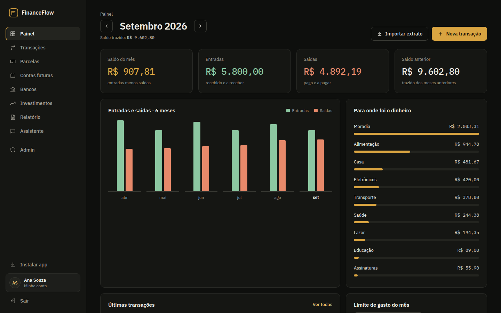
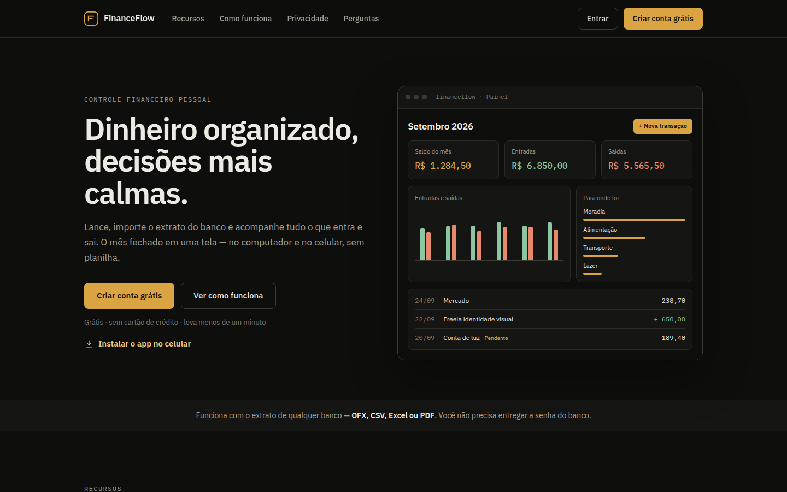
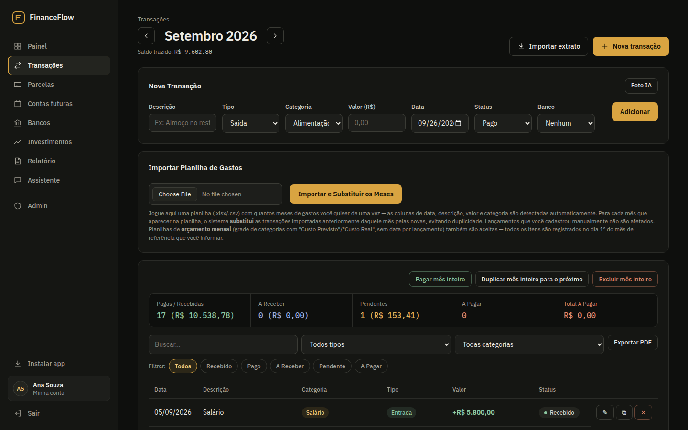
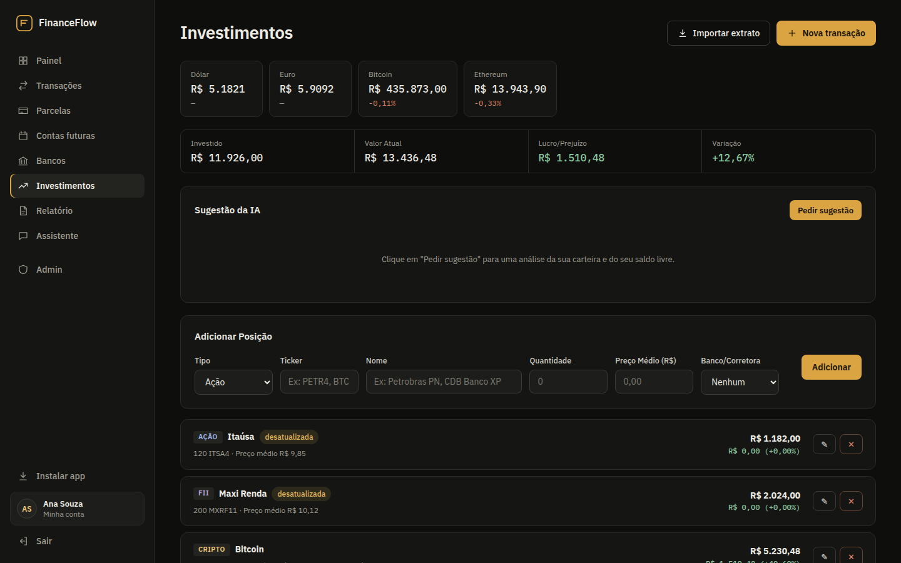
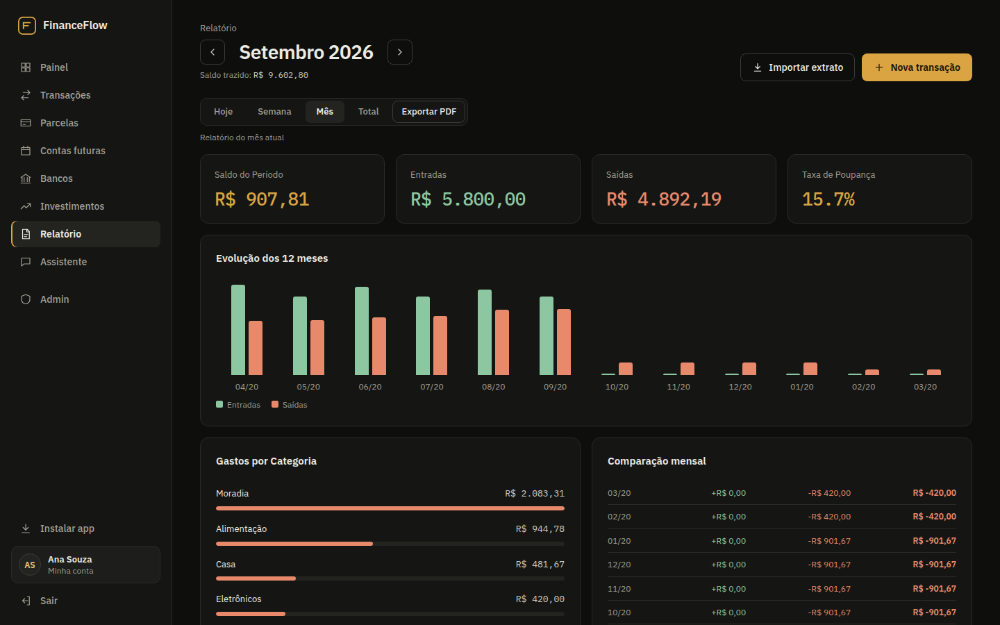
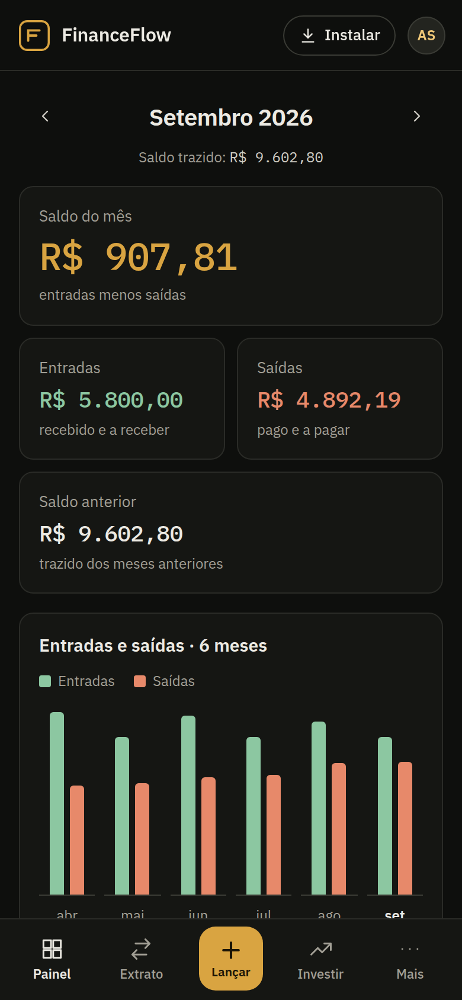

# FinanceFlow — Controle Financeiro Pessoal

[](https://github.com/Mhsilva-dev/financeflow/actions/workflows/ci.yml)

Aplicação web de finanças pessoais, multiusuário, com importação de extratos bancários, parcelas, investimentos com cotação atualizada e um assistente que responde perguntas sobre os próprios lançamentos. Funciona no computador e instala no celular como aplicativo (PWA).

**🔗 Sistema em produção:** [financas.mhsilvadev.com.br](https://financas.mhsilvadev.com.br)

> O sistema está no ar e aberto para cadastro. Cada conta é isolada: você começa com um painel vazio e só você vê o que lançar.


<p align="center">
  
</p>

## Telas

| Página inicial | Transações |
|---|---|
|  |  |

| Investimentos | Relatório |
|---|---|
|  |  |

<p align="center">
  
</p>

> Os dados que aparecem nas imagens são fictícios.

## Funcionalidades

**Controle do mês**
- Painel com saldo do mês, entradas, saídas e saldo trazido dos meses anteriores
- Gráfico dos últimos seis meses e gastos por categoria
- Status por lançamento (pago, recebido, pendente, a pagar, a receber) e ações em lote: pagar, duplicar ou excluir o mês inteiro
- Compras parceladas geram automaticamente as parcelas de cada mês
- Contas futuras com prioridade e aviso no dia do vencimento
- Limite de gasto mensal com notificação push quando é ultrapassado

**Importação**
- Extratos em **OFX, CSV, Excel e PDF**, sem pedir a senha do banco
- O banco é identificado automaticamente (código FEBRABAN no OFX ou nome no arquivo/texto)
- Importação sem duplicar lançamentos, com modo "substituir" para planilhas que cobrem vários meses
- Foto de comprovante lida pela IA, que preenche a transação

**Investimentos**
- Ações, FIIs, cripto e renda fixa em uma carteira
- Cotações atualizadas (B3, cripto e câmbio) com cache, lucro/prejuízo por posição e variação total

**Assistente**
- Perguntas em linguagem natural ("quanto gastei com mercado em agosto?"), respondidas com base nos dados reais do usuário

**Conta e administração**
- Cadastro, login por usuário ou e-mail, troca de senha e "esqueci a senha" por e-mail
- Tema claro/escuro e cor de destaque
- Exportação de todos os dados em Excel e exclusão definitiva da conta
- Relatórios em PDF
- Painel administrativo com os usuários cadastrados e quem está online

## Destaques técnicos

- **Assistente com function calling.** Em vez de enviar um bloco fixo de dados para o modelo, o Gemini recebe uma lista de consultas (resumo de um mês, transações filtradas, contas a vencer, comparação entre meses, carteira) e decide qual chamar. Toda consulta é filtrada pelo usuário da sessão: o modelo nunca escolhe de quem são os dados.
- **Fallback entre modelos e limite de uso.** Se um modelo falha ou estoura a cota, o próximo da lista é usado; um rate limiter de janela deslizante mantém as chamadas abaixo do limite do plano gratuito.
- **Multiusuário por linha.** Todas as tabelas de dados têm `usuario_id` e todas as queries filtram por ele. As migrações convertem automaticamente um banco antigo, de um só usuário, para o modelo multiusuário.
- **Parsers de extrato próprios.** Leitura de OFX, CSV e Excel com tratamento do formato brasileiro de números e datas; PDFs são interpretados pelo Gemini. Um índice único em `(usuario_id, banco, id_externo)` impede duplicatas ao reimportar.
- **Tempo real.** WebSocket autenticado pela mesma sessão do HTTP: uma alteração feita no celular aparece na hora no computador, e cada evento só é entregue às abas do dono do dado.
- **Notificações push (Web Push/VAPID)** e tarefas agendadas com **node-cron**: limite de gasto, vencimentos do dia e lembrete de inatividade.
- **Segurança.** Senhas com bcrypt, sessão em cookie `httpOnly`/`sameSite`, limite de tentativas por IP no login e cadastro, token de redefinição de senha guardado só como hash e com expiração, CORS restrito à origem do app, validação do endpoint de push (evita SSRF), escape de conteúdo dinâmico no front-end e servidor escutando só em `127.0.0.1` atrás do Nginx.
- **Fuso horário.** "Hoje" e "mês atual" são sempre calculados no fuso de Brasília, independentemente do fuso do servidor.
- **Sem framework no front-end.** SPA em JavaScript puro, dividida em módulos por área, com service worker e manifest para instalação como PWA.

## Arquitetura

```
Navegador / PWA ──► Nginx (SSL) ──► Node.js / Express ──► SQLite
      ▲                                   │
      └──────── WebSocket ────────────────┤
                                          ├── node-cron (alertas e vencimentos)
                                          ├── Web Push (VAPID)
                                          ├── Google Gemini (assistente, fotos e PDFs)
                                          ├── APIs de cotação (B3, cripto, câmbio)
                                          └── Puppeteer (relatórios em PDF)
```

A documentação técnica, com diagramas em Mermaid, fica em [`docs/`](docs/):

- [Arquitetura](docs/arquitetura.md)
- [Banco de dados (ERD)](docs/banco-de-dados.md)
- [Assistente com function calling](docs/assistente.md)
- [Importação de extratos](docs/importacao.md)
- [Referência da API](docs/api-referencia.md)

## Estrutura

```
src/
├── server.js              Express, sessão, WebSocket e rotas
├── db.js                  schema SQLite e migrações
├── gemini.js              integração com o Gemini (chat, fotos, PDFs)
├── scheduler.js           tarefas agendadas (node-cron)
├── push.js                notificações Web Push
├── middleware/auth.js     login obrigatório e acesso de administrador
├── routes/                auth, transações, parcelas, contas futuras, bancos,
│                          investimentos, relatório, assistente, admin, push
├── services/
│   ├── assistente.js      consultas disponíveis para o function calling
│   └── cotacoes.js        cotações com cache
└── utils/                 importação de extratos, detecção de banco, PDF,
                           exportação para Excel, e-mail, datas

public/
├── landing.html           página de apresentação
├── index.html             SPA do app
├── sw.js, manifest.json   PWA
├── css/
└── js/                    um módulo por área (painel, transações, investimentos…)
```

## Como rodar localmente

Requisitos: Node.js 20 ou superior.

```bash
git clone https://github.com/Mhsilva-dev/financeflow.git
cd financeflow

npm install
cp .env.example .env     # defina SESSION_SECRET
npm run dev
```

Acesse `http://localhost:3001` e crie uma conta — a primeira conta criada vira administradora. O banco SQLite é criado automaticamente na primeira execução.

Opcionais: `GEMINI_API_KEY` ativa o assistente e a leitura de fotos/PDFs; as chaves VAPID ativam as notificações push; as variáveis `SMTP_*` ativam o "esqueci a senha". Sem elas o restante do app funciona normalmente.

## Deploy

Em produção, a aplicação roda em uma VPS Linux com **PM2** ([`ecosystem.config.js`](ecosystem.config.js)) e **Nginx** como proxy reverso com SSL do **Let's Encrypt**. O repositório inclui um [`nginx.conf`](nginx.conf) de referência.

## Autor

Desenvolvido por **Matheus Henrique Fonseca Silva** — [github.com/Mhsilva-dev](https://github.com/Mhsilva-dev)
