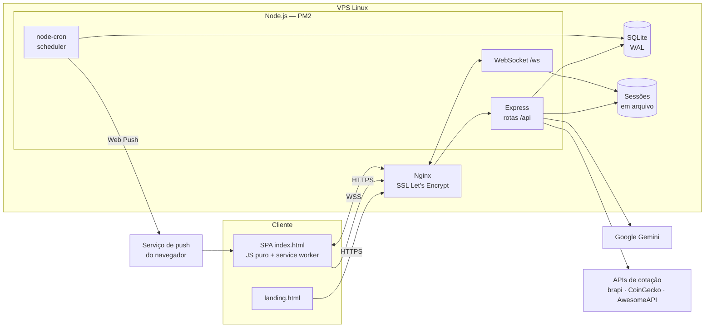

# Arquitetura

O FinanceFlow é um monólito Node.js: um único processo Express serve a página de apresentação, a SPA, a API REST e o WebSocket. Os dados ficam em um arquivo SQLite acessado com `better-sqlite3` (síncrono, sem pool de conexões).

## Requisição autenticada

1. O login grava `userId` na sessão (`express-session` com armazenamento em arquivo) e devolve um cookie `httpOnly`, `sameSite=lax` e `secure` em produção.
2. O middleware `exigirLogin` protege tudo abaixo de `/api` (exceto autenticação, chave pública VAPID e `/api/health`) e expõe `req.uid`.
3. Cada rota filtra as consultas por `usuario_id = req.uid`. Quando uma rota recebe o ID de um banco, parcela ou transação, confere que ele pertence ao usuário antes de usar.
4. Após gravar, a rota chama `broadcastWS(evento, uid)`: o evento vai apenas para as conexões WebSocket daquele usuário, que recarregam a tela correspondente.

## WebSocket

A conexão em `/ws` passa pelo mesmo `sessionParser` do HTTP. Sem sessão válida, é fechada com código `1008`; origens fora da lista permitida também são recusadas. O servidor mantém um `Set` de conexões marcadas com o `uid`, usado para os eventos em tempo real e para o painel administrativo mostrar quem está online.

## Tarefas agendadas

| Quando | Tarefa |
|---|---|
| A cada hora | Verifica, para cada usuário, se o gasto do mês passou do limite configurado e envia push (uma vez por mês) |
| Todo dia às 8h | Envia push das contas que vencem no dia (marca a transação para não repetir) |
| Todo dia às 10h | Lembrete para quem está há vários dias sem abrir o app |

Os horários seguem o fuso de Brasília.

## Front-end

- `landing.html` é servida em `/` para visitantes; quem já tem sessão recebe o app direto.
- O app é uma SPA sem framework: `core.js` concentra estado, chamadas à API e navegação entre abas; cada área tem o próprio módulo (`dashboard.js`, `transacoes.js`, `investimentos.js`, `ia-chat.js`…).
- HTML e service worker são servidos com `Cache-Control: no-store`, para que um deploy novo chegue imediatamente; só os ícones ficam em cache.
- `manifest.json` + `sw.js` tornam o app instalável (Android instala direto; no iPhone há um passo a passo pelo Safari).

## Migrações

Não há ferramenta de migração externa: `db.js` cria as tabelas que faltam e adiciona colunas novas com `ALTER TABLE` ao abrir o banco. A migração para multiusuário adiciona `usuario_id` a todas as tabelas de dados, atribui os registros antigos à primeira conta (que vira administradora) e recria os índices de deduplicação por usuário.
