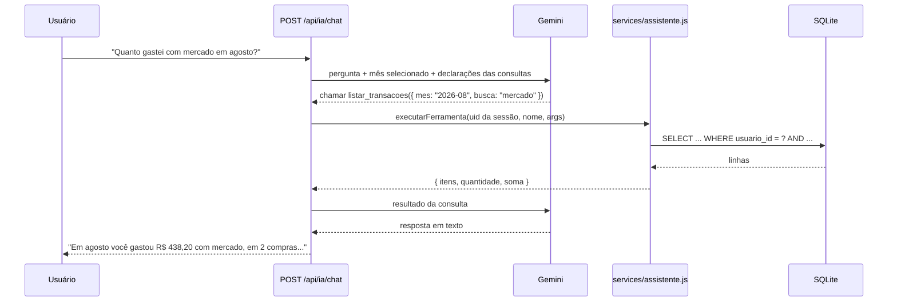

# Assistente com function calling

A primeira versão do assistente enviava ao modelo um bloco fixo de dados junto com a pergunta. Isso misturava o mês atual com o total de todos os meses e gerava respostas imprecisas. A versão atual usa **function calling** do Gemini: o modelo recebe a pergunta e uma lista de consultas disponíveis, escolhe qual executar e responde com base no resultado.

## Consultas disponíveis

| Nome | Retorna |
|---|---|
| `resumo_mes` | Entradas, saídas, saldo, pago × pendente, saldo trazido, categorias, maiores gastos, limite e comparação com o mês anterior |
| `listar_transacoes` | Transações filtradas por mês, categoria, tipo, status ou texto, com quantidade e soma |
| `historico_mensal` | Série mês a mês de um período, com média mensal |
| `contas_a_vencer` | Pendências (inclusive atrasadas), despesas previstas e valores a receber nos próximos N dias |
| `resumo_geral` | Totais de todos os meses, saldo dos bancos, parcelas ativas e total investido |
| `carteira_investimentos` | Posições com valor aplicado, cotação atual e lucro/prejuízo |

## Garantias

- **Isolamento.** O `uid` vem sempre da sessão e é passado pelo servidor ao executor; ele não faz parte dos parâmetros declarados, então o modelo não tem como pedir dados de outra pessoa.
- **Parâmetros validados.** Meses são conferidos com expressão regular e limites (quantidade de itens, dias, meses) são aplicados no servidor, independentemente do que o modelo pedir.
- **Contexto do mês.** A pergunta vai acompanhada do mês selecionado na tela; se a pessoa não citar outro mês, é esse o considerado.
- **Escopo.** As instruções de sistema limitam o assistente a assuntos financeiros do próprio usuário.
- **Resiliência.** Uma lista de modelos é tentada em ordem quando há erro ou cota esgotada, e um rate limiter de janela deslizante evita ultrapassar o limite de requisições por minuto.
