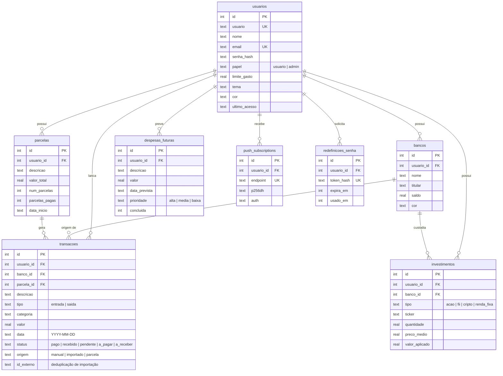

# Banco de dados

SQLite em modo WAL, com `foreign_keys` ativado. Todas as tabelas de dados pertencem a um usuário (`usuario_id`, com `ON DELETE CASCADE`): excluir a conta apaga tudo o que ela tem.

Tabelas de apoio, sem vínculo com usuário: `cotacoes_cache` (última cotação de cada ativo) e `gemini_uso` / `gemini_erros` (consumo e falhas do modelo, exibidos no painel administrativo).

## Índices

| Índice | Motivo |
|---|---|
| `transacoes(usuario_id)`, `(data)`, `(strftime('%Y-%m', data))`, `(status)` | Painel e extrato são sempre filtrados por usuário e mês |
| `transacoes(parcela_id)` | Pagar ou excluir uma compra parcelada |
| `UNIQUE transacoes(usuario_id, COALESCE(banco_id,0), id_externo)` | Reimportar o mesmo extrato não duplica lançamentos, mas dois bancos (ou dois usuários) podem ter lançamentos idênticos |
| `UNIQUE usuarios(email)` parcial | E-mail é opcional para contas antigas, mas único quando existe |

## Saldo trazido

O "saldo anterior" de um mês considera apenas dinheiro que de fato entrou ou saiu: entradas `recebido`/`pago` e saídas `pago` de todos os meses anteriores. Lançamentos pendentes não contaminam o saldo acumulado.
