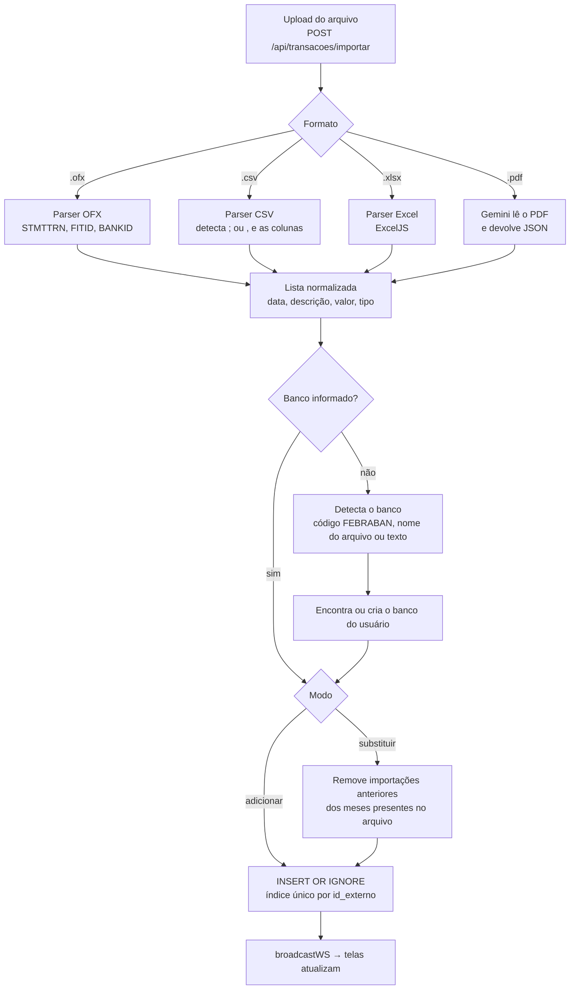

# Importação de extratos

Em vez de integrar com Open Finance (que exige credenciamento e acesso à conta bancária), o FinanceFlow importa o arquivo de extrato que o próprio banco disponibiliza. O usuário nunca informa a senha do banco.

## Normalização

- **Valores.** Aceita o formato brasileiro (`1.234,56`, `R$ -50,00`, `(120,00)`) e o internacional. Sem vírgula, o ponto é tratado como separador de milhar, que é o padrão dos bancos brasileiros.
- **Datas.** `YYYY-MM-DD`, `YYYYMMDD` (OFX) e `DD/MM/YYYY`.
- **Tipo.** Definido pelo sinal do valor: positivo é entrada, negativo é saída.
- **Colunas.** Em CSV e Excel, as colunas de data, descrição, valor e categoria são reconhecidas pelo cabeçalho. Planilhas de orçamento mensal (colunas "Custo previsto"/"Custo real", sem data por lançamento) também são aceitas: os itens são lançados no dia 1º do mês de referência.

## Deduplicação

Cada transação importada recebe um `id_externo`: o `FITID` do OFX quando existe, ou um identificador derivado de data, descrição e valor (com o formato de origem como prefixo). O índice único `(usuario_id, COALESCE(banco_id, 0), id_externo)` faz o banco de dados rejeitar repetições, então reenviar o mesmo arquivo não duplica nada. O índice inclui o banco para que duas contas com lançamentos idênticos (por exemplo, de titulares diferentes) não se anulem.

## Modo "substituir"

Pensado para quem mantém uma planilha geral de gastos cobrindo vários meses e a reenvia sempre atualizada. Para cada mês presente no arquivo, as transações com `origem = 'importado'` daquele mês são removidas e substituídas pelas novas. Lançamentos manuais e parcelas nunca são afetados.

## Foto de comprovante

`POST /api/transacoes/foto` recebe a imagem de um cupom ou comprovante, o Gemini extrai descrição, valor e categoria, e o formulário de nova transação é preenchido para o usuário revisar antes de salvar.
